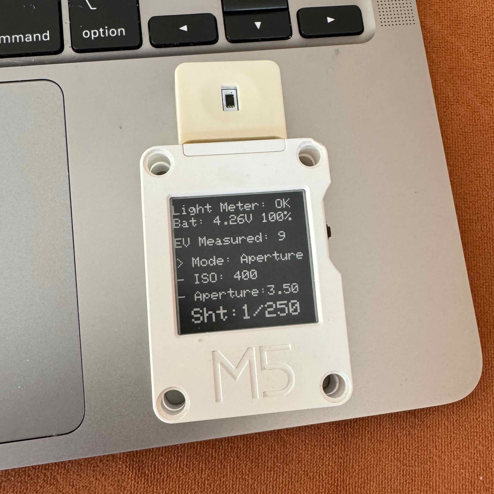

# M5CoreInk Light Meter



This project is a light meter application for the M5Stack CoreInk device. It measures the light intensity using a BH1750 sensor and calculates the exposure value (EV) for photography. The application allows users to select different modes, ISO values, shutter speeds, and apertures.

## Features

* Measure light intensity using the BH1750 sensor
* Calculate exposure value (EV)
* Aperture priority and shutter priority modes
* Selectable ISO values, shutter speeds, and apertures
* Save and load settings to/from EEPROM
* Display information on the M5Stack CoreInk e-ink display
* Battery voltage monitoring
* Enter sleep mode after inactivity

## Hardware Requirements

* M5Stack CoreInk
* BH1750 light sensor

## Software Requirements

* PlatformIO
* Arduino framework
* Adafruit GFX Library
* Adafruit BusIO
* GxEPD2 Library

## Installation

1. Clone the repository:
   ```sh
   git clone https://github.com/jujax/m5coreink-lightmeter.git
   ```
2. Open the project in PlatformIO.
3. Connect the M5Stack CoreInk device to your computer.
4. Upload the code to the device.

## Usage

1. Power on the M5Stack CoreInk device.
2. The light meter will initialize and display the current settings.
3. Use the buttons to navigate the menu and adjust the settings:
   - `BTN_UP`: Move up in the menu or increase the selected value.
   - `BTN_DOWN`: Move down in the menu or decrease the selected value.
   - `BTN_OK`: Select the current menu item or toggle edit mode.
   - `BTN_POWER`: Measure the ambient light and update the exposure value (EV).
4. The device will enter sleep mode after 60 seconds of inactivity.

## Contributing

Contributions are welcome! Please follow these steps to contribute:

1. Fork the repository.
2. Create a new branch for your feature or bugfix.
3. Commit your changes and push the branch to your fork.
4. Create a pull request with a description of your changes.

## License

This project is licensed under the MIT License. See the LICENSE file for details.

## Acknowledgements

* Adafruit GFX Library
* Adafruit BusIO
* GxEPD2 Library
* BH1750 Library